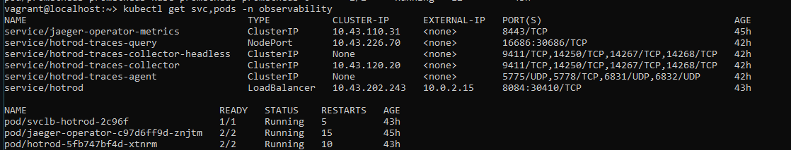
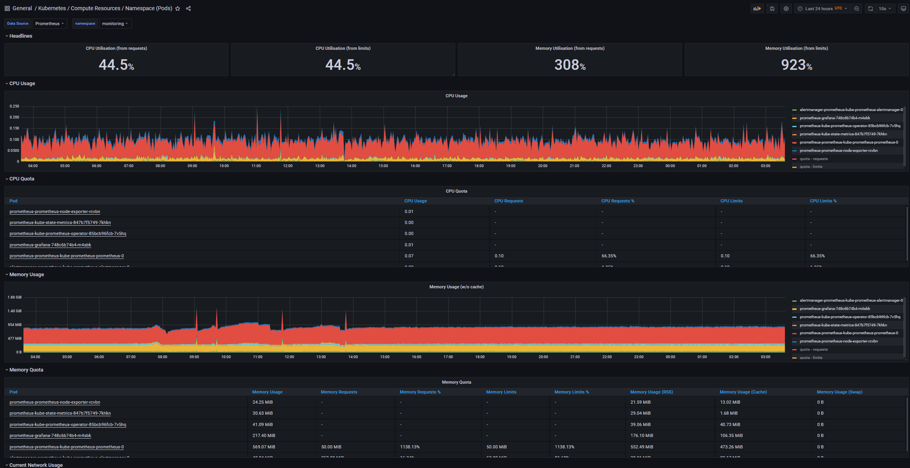
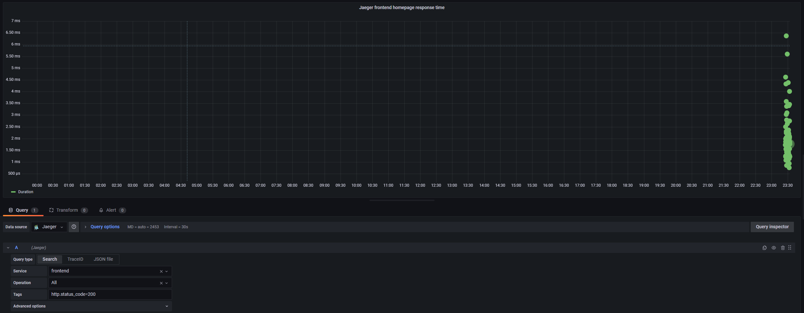

**Note:** For the screenshots, you can store all of your answer images in the `answer-img` directory.

# Issues while setting up for observability project and solution:

*Issue 0* : Kubectl: The connection to the server 127.0.0.1:6443 was refused.

*Solution* :
```
Refer to repo vagrant file for adding port forward 'config.network"forwarded_port",guest: 6443,host: 6443'
```

*Issue 1*: Vagrant was unable to mount VirtualBox shared folders. This is usually because the filesystem "vboxsf" is not available.

*Solution*: 

```
https://stackoverflow.com/questions/43492322/vagrant-was-unable-to-mount-virtualbox-shared-folders
```

*Issue 2*: Error: INSTALLATION FAILED: failed to download "prometheus-community/kube-prometheus-stack"

*Solution* : 
```
Go to vagrant ssh box:
 Step 1  : Install helm chart:
 curl -fsSL -o get_helm.sh https://raw.githubusercontent.com/helm/helm/main/scripts/get-helm-3
 chmod 700 get_helm.sh
 ./get_helm.sh

 Step 2 : install prometheus community
 helm repo add prometheus-community https://prometheus-community.github.io/helm-charts
 helm repo update
 helm install prometheus prometheus-community/kube-prometheus-stack --namespace monitoring --kubeconfig /etc/rancher/k3s/k3s.yaml

 After installation without error:
 Runs 'kubectl get pods -n monitoring' to check all pods should be running.
```

*Issue 3*: error: unable to read URL "https://raw.githubusercontent.com/jaegertracing/jaeger-operator//deploy/crds/jaegertracing.io_jaegers_crd.yaml", server reported 404 Not Found, status code=404

Explaination : this is due to {jaeger_version} wasn't defined.

*Solution* : 
```
export jaeger_version=v1.28.0

kubectl create namespace observability
kubectl create -f https://raw.githubusercontent.com/jaegertracing/jaeger-operator/${jaeger_version}/deploy/crds/jaegertracing.io_jaegers_crd.yaml
kubectl create -n observability -f https://raw.githubusercontent.com/jaegertracing/jaeger-operator/${jaeger_version}/deploy/service_account.yaml
kubectl create -n observability -f https://raw.githubusercontent.com/jaegertracing/jaeger-operator/${jaeger_version}/deploy/role.yaml
kubectl create -n observability -f https://raw.githubusercontent.com/jaegertracing/jaeger-operator/${jaeger_version}/deploy/role_binding.yaml
kubectl create -n observability -f https://raw.githubusercontent.com/jaegertracing/jaeger-operator/${jaeger_version}/deploy/operator.yaml
```

*Issue 4*: Observability - jaeger have no resources

*Solution*:
```
*Note: This setup will take long for deployment to get ready.*
*You can check for the deployment through  'kubectl describe deployment jaeger-operator -n observability'*


There's two line code to help install all jaeger resources
kubectl create namespace observability # <1>
kubectl create -f https://github.com/jaegertracing/jaeger-operator/releases/download/v1.30.0/jaeger-operator.yaml -n observability # <2>

Reference link : https://www.jaegertracing.io/docs/1.30/operator/
```

## Verify the monitoring installation

*TODO:* run `kubectl` command to show the running pods and services for all components. Take a screenshot of the output and include it here to verify the installation




## Setup the Jaeger and Prometheus source
*TODO:* Expose Grafana to the internet and then setup Prometheus as a data source. Provide a screenshot of the home page after logging into Grafana.


## Create a Basic Dashboard
*TODO:* Create a dashboard in Grafana that shows Prometheus as a source. Take a screenshot and include it here.



## Describe SLO/SLI
```
SLO - The end goal of a standard level of performance in a measurable period of time for e.g. 99.5% server uptime in a month
SLI - Measurement on performance specifically this make measuring the objective we set in SLO measurable.  for e.g. number of server error causing unplanned reboot.
```
## Creating SLI metrics.
```
* Error Rate
* Response time
* Availability
* Throughput
* Latency
```

## Create a Dashboard to measure our SLIs
*TODO:* Create a dashboard to measure the uptime of the frontend and backend services We will also want to measure to measure 40x and 50x errors. Create a dashboard that show these values over a 24 hour period and take a screenshot.


## Tracing our Flask App
*TODO:*  We will create a Jaeger span to measure the processes on the backend. Once you fill in the span, provide a screenshot of it here. Also provide a (screenshot) sample Python file containing a trace and span code used to perform Jaeger traces on the backend service.


## Jaeger in Dashboards
*TODO:* Now that the trace is running, let's add the metric to our current Grafana dashboard. Once this is completed, provide a screenshot of it here.



## Report Error
*TODO:* Using the template below, write a trouble ticket for the developers, to explain the errors that you are seeing (400, 500, latency) and to let them know the file that is causing the issue also include a screenshot of the tracer span to demonstrate how we can user a tracer to locate errors easily.

TROUBLE TICKET

Name: Error 500 while trying to visit /trace 

Date: 4th April 2022 , 21:33

Subject: Trial service route /trace showing internal error 500

Affected Area: Trial service

Severity: High Severity

Description: Accessing /trace route in trial service get error 500.


## Creating SLIs and SLOs
*TODO:* We want to create an SLO guaranteeing that our application has a 99.95% uptime per month. Name four SLIs that you would use to measure the success of this SLO.

- Resource consumption - CPU and memory usage
- Service availability - Backend/Frontend availability
- Response error occurence - HTTP 4xx and 5xx status code
- Service reponse - Number of request and Response time 


## Building KPIs for our plan
*TODO*: Now that we have our SLIs and SLOs, create a list of 2-3 KPIs to accurately measure these metrics as well as a description of why those KPIs were chosen. We will make a dashboard for this, but first write them down here.


1. Server CPU and memory usage,ensure sufficient resources is provided to the application to minimize potential issue.
    - Server CPU usage
    - Server Memory Usage

2. Mesure the availability of services to ensure it is accessible to the endpoints access.
    - Measure Backend Availability
    - Measure Frontend Availability

3. Track and measure potential non-sucessful request obtained (any status code that is not 200)
    - Error 4xx mesure
    - Error 5xx mesure
    
4. Services Request and response time averagely needed per request.
    - Total requests per minute
    - Average response


## Final Dashboard
*TODO*: Create a Dashboard containing graphs that capture all the metrics of your KPIs and adequately representing your SLIs and SLOs. Include a screenshot of the dashboard here, and write a text description of what graphs are represented in the dashboard.  


The highest row of the dashboard show the total CPU usage and Memory usage from the current resources.

Second row left diagram show endpoint request per minute for different route and status return.

Second row right diagram show Backend Availability and Frontend availability underneath it.

Third row shows the backend 40X error count over 24 hours period.

Last row shows jaeger frontend homepage response time.